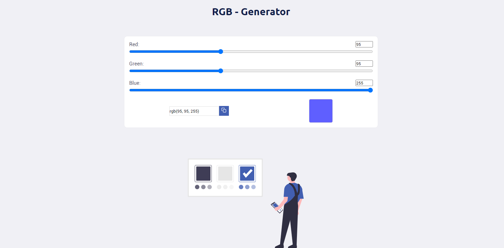

# RGB - Generator

Desenvolvido com o intuito de tornar mais rápida a dinâmica a sua escolha de cores na hora da estilização [CSS](https://www.w3schools.com/css/)

## Instalação e modo de uso

Como durante o desenvolvimento foi utilizado o [Yarn](https://yarnpkg.com/) (pode ser utilizado o [NPM](https://www.npmjs.com/) se preferir) como gerenciador de pacotes, execute o comando `yarn` na raiz do projeto para baixar as dependências.

Com as dependências já baixadas, basta iniciar o servidor. Uso o comando `yarn start` para fazer isso (novamente, pode ser utilizado o [NPM](https://www.npmjs.com/) se preferir)

## Quais tecnologias foram usadas?

1. [ReactJS](https://reactjs.org/)
2. [Typescript](https://www.typescriptlang.org/)

Utilizei também o pacote de ícones [react-icons](https://react-icons.github.io/react-icons/)
